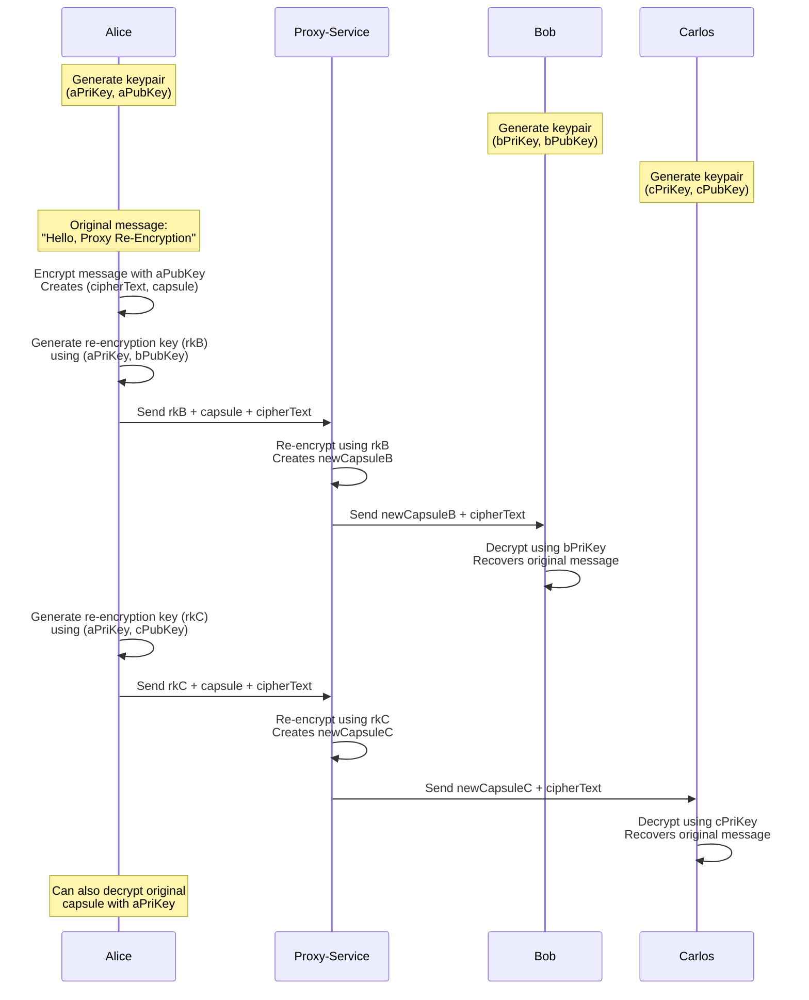

```mermaid
sequenceDiagram
    participant A as Alice
    participant S as Proxy-Service
    participant B as Bob
    participant C as Carlos

    Note over A: Generate keypair<br/>(aPriKey, aPubKey)
    Note over B: Generate keypair<br/>(bPriKey, bPubKey)
    Note over C: Generate keypair<br/>(cPriKey, cPubKey)

    %% Initial Encryption
    Note over A: Original message:<br/>"Hello, Proxy Re-Encryption"
    A->>A: Encrypt message with aPubKey<br/>Creates (cipherText, capsule)

    %% Re-encryption key generation for both recipients
    A->>A: Generate re-encryption key (rkB)<br/>using (aPriKey, bPubKey)
  

    %% Send to server
    A->>S: Send rkB + capsule + cipherText
    S->>S: Re-encrypt using rkB<br/>Creates newCapsuleB
    S->>B: Send newCapsuleB + cipherText
    B->>B: Decrypt using bPriKey<br/>Recovers original message
    

    A->>A: Generate re-encryption key (rkC)<br/>using (aPriKey, cPubKey)
    A->>S: Send rkC + capsule + cipherText
    S->>S: Re-encrypt using rkC<br/>Creates newCapsuleC
    S->>C: Send newCapsuleC + cipherText
    C->>C: Decrypt using cPriKey<br/>Recovers original message

    Note over A: Can also decrypt original<br/>capsule with aPriKey
```
