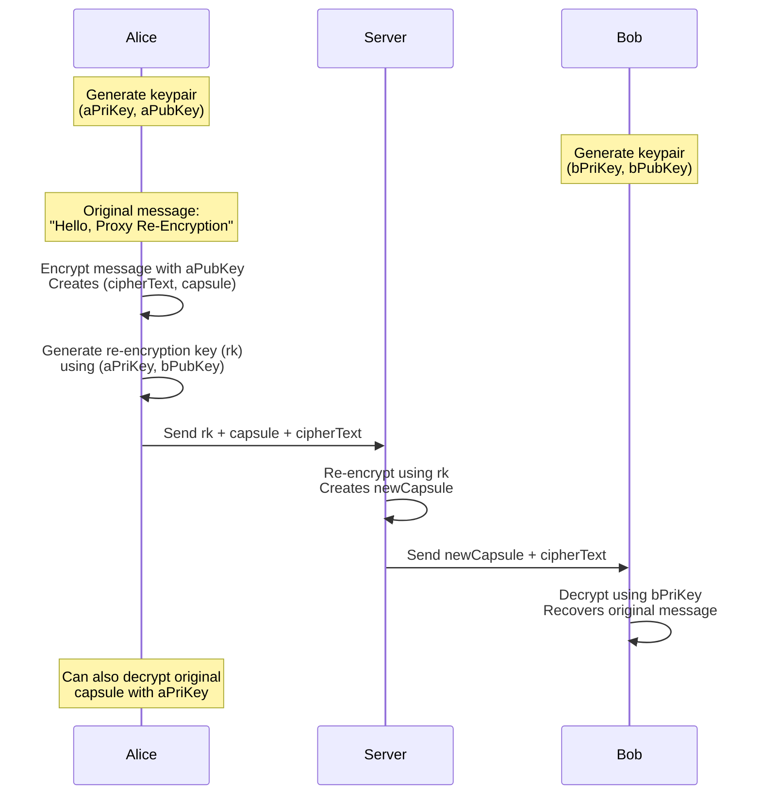

```mermaid
sequenceDiagram
    participant A as Alice
    participant S as Server
    participant B as Bob

    Note over A: Generate keypair<br/>(aPriKey, aPubKey)
    Note over B: Generate keypair<br/>(bPriKey, bPubKey)

    %% Initial Encryption
    Note over A: Original message:<br/>"Hello, Proxy Re-Encryption"
    A->>A: Encrypt message with aPubKey<br/>Creates (cipherText, capsule)

    %% Re-encryption key generation
    A->>A: Generate re-encryption key (rk)<br/>using (aPriKey, bPubKey)
    A->>S: Send rk + capsule + cipherText

    %% Server Re-encryption
    S->>S: Re-encrypt using rk<br/>Creates newCapsule
    S->>B: Send newCapsule + cipherText

    %% Decryption
    B->>B: Decrypt using bPriKey<br/>Recovers original message

    Note over A: Can also decrypt original<br/>capsule with aPriKey
```
