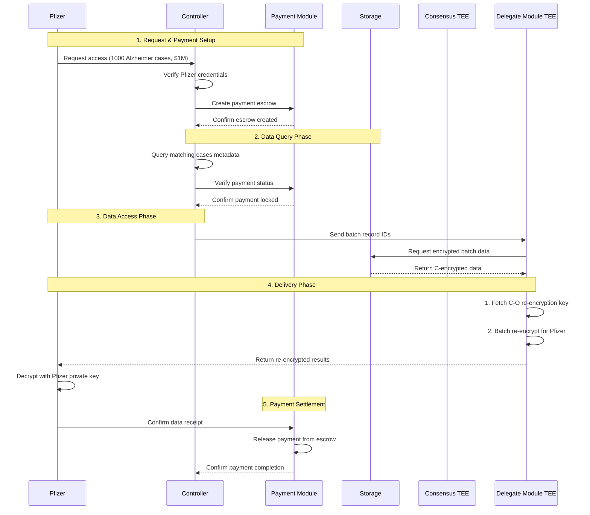

```mermaid
sequenceDiagram
    participant P as Pfizer
    participant G as Controller
    participant PM as Payment Module
    participant S as Storage
    participant C as Consensus TEE
    participant DM as Delegate Module TEE

    %% Setup & Payment Phase
    Note over P,PM: 1. Request & Payment Setup
    P->>G: Request access (1000 Alzheimer cases, $1M)
    G->>G: Verify Pfizer credentials
    G->>PM: Create payment escrow
    PM-->>G: Confirm escrow created

    %% Data Query Phase
    Note over G,S: 2. Data Query Phase
    G->>G: Query matching cases metadata
    G->>PM: Verify payment status
    PM-->>G: Confirm payment locked

    %% Data Access Phase
    Note over G,P: 3. Data Access Phase
    G->>DM: Send batch record IDs
    DM->>S: Request encrypted batch data
    S-->>DM: Return C-encrypted data

    %% Re-encryption & Delivery
    Note over DM,P: 4. Delivery Phase
    DM->>DM: 1. Fetch C-O re-encryption key
    DM->>DM: 2. Batch re-encrypt for Pfizer
    DM-->>P: Return re-encrypted results
    P->>P: Decrypt with Pfizer private key

    %% Payment Settlement
    Note over PM: 5. Payment Settlement
    P->>PM: Confirm data receipt
    PM->>PM: Release payment from escrow
    PM-->>G: Confirm payment completion
```
