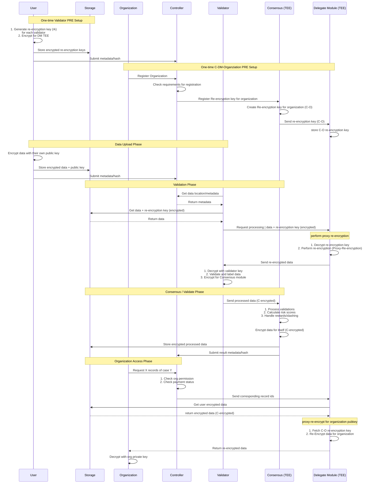

```mermaid
sequenceDiagram
    participant U as User
    participant S as Storage
    participant O as Organization
    participant G as Controller
    participant V as Validator
    participant C as Consensus (TEE)
    participant DM as Delegate Module (TEE)


    %% One-time User Validator Setup
    Note over U,S: One-time Validator PRE Setup
    U->>U: 1. Generate re-encryption key (rk)<br/>for each validator <br/> 2. Encrypt for DM TEE
    U->>S: Store encrypted re-encryption keys
    U->>G: Submit metadata/hash

    %% One-time C-DM-Organziation PRE Setup
    Note over O,DM: One-time C-DM-Organziation PRE Setup
    O->>G: Register Organization
    G->>G: Check requirements for registration
    G->>C: Register Re-encryption key for organization
    C->>C: Create Re-encryption key for organization (C-O)
    C->>DM: Send re-encryption key (C-O)
    DM->>DM: store C-O re-encryption key


    %% Data Upload with PRE
    Note over U,V: Data Upload Phase
    U->>U: Encrypt data with their own public key
    U->>S: Store encrypted data + public key
    U->>G: Submit metadata/hash

    %% Validator Processing
    Note over S,C: Validation Phase
    V->>G: Get data location/metadata
    G-->>V: Return metadata
    V->>S: Get data + re-encryption key (encrypted)
    S-->>V: Return data

    V->>DM: Request processing | data + re-encryption key (encrypted)
    Note over DM: perform proxy re-encryption
    DM->>DM: 1. Decrypt re-encryption key<br/>2. Perform re-encryption (Proxy-Re-encryption)
    DM->>V: Send re-encrypted data

    V->>V: 1. Decrypt with validator key<br/>2. Validate and label data <br/> 3. Encrypt for Consensus module

    %% Consensus Phase
    Note over C,S: Consensus / Validate Phase
    V->>C: Send processed data (C-encrypted)
    C->>C: 1. Process validations<br/>2. Calculate risk scores<br/>3. Handle rewards/slashing
    C->>C: Encrypt data for itself (C-encrypted)
    C->>S: Store encrypted processed data
    C->>G: Submit result metadata/hash

    %% Organization Access
    Note over S,G: Organization Access Phase
    O->>G: Request X records of case Y
    G->>G: 1. Check org permission <br/> 2. Check payment status
    G->>DM: Send corresponding record ids
    DM->>S: Get user encrypted data
    S-->>DM: return encrypted data (C-encrypted)

    Note over DM: proxy-re-encrypt for organization pubkey
    DM->>DM: 1. Fetch C-O re-encryption key <br/> 2. Re-Encrypt data for organization
    DM-->>O: Return re-encrypted data
    O->>O: Decrypt with org private key
```
