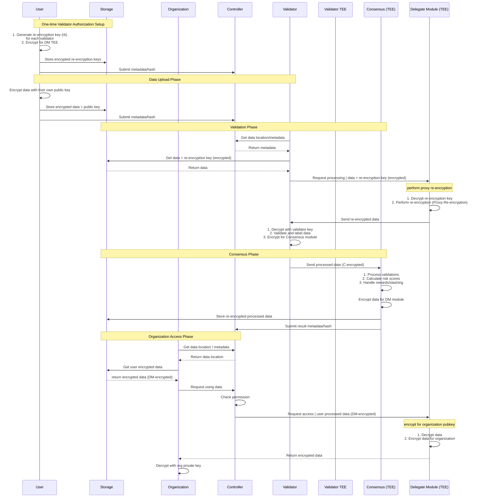

```mermaid
sequenceDiagram
    participant U as User
    participant S as Storage
    participant O as Organization
    participant G as Controller
    participant V as Validator
    participant VT as Validator TEE
    participant C as Consensus (TEE)
    participant DM as Delegate Module (TEE)

    %% One-time User Validator Setup
    Note over U,S: One-time Validator Authorization Setup
    U->>U: 1. Generate re-encryption key (rk)<br/>for each validator <br/> 2. Encrypt for DM TEE
    U->>S: Store encrypted re-encryption keys
    U->>G: Submit metadata/hash


    %% Data Upload with PRE
    Note over U,V: Data Upload Phase
    U->>U: Encrypt data with their own public key
    U->>S: Store encrypted data + public key
    U->>G: Submit metadata/hash

    %% Validator Processing
    Note over S,C: Validation Phase
    V->>G: Get data location/metadata
    G-->>V: Return metadata
    V->>S: Get data + re-encryption key (encrypted)
    S-->>V: Return data

    V->>DM: Request processing | data + re-encryption key (encrypted)
    Note over DM: perform proxy re-encryption
    DM->>DM: 1. Decrypt re-encryption key<br/>2. Perform re-encryption (Proxy-Re-encryption)
    DM->>V: Send re-encrypted data

    V->>V: 1. Decrypt with validator key<br/>2. Validate and label data <br/> 3. Encrypt for Consensus module

    %% Consensus Phase
    Note over C,S: Consensus Phase
    V->>C: Send processed data (C-encrypted)
    C->>C: 1. Process validations<br/>2. Calculate risk scores<br/>3. Handle rewards/slashing
    C->>C: Encrypt data for DM module
    C->>S: Store re-encrypted processed data
    C->>G: Submit result metadata/hash

    %% Organization Access
    Note over S,G: Organization Access Phase
    O->>G: Get data location / metadata
    G-->>O: Return data location
    O->>S: Get user encrypted data
    S-->>O: return encrypted data (DM-encrypted)

    O->>G: Request using data
    G->>G: Check permission

    G->>DM: Request access | user processed data (DM-encrypted)
    Note over DM: encrypt for organization pubkey
    DM->>DM: 1. Decrypt data <br/> 2. Encrypt data for organization
    DM-->>O: Return encrypted data

    O->>O: Decrypt with org private key
```
