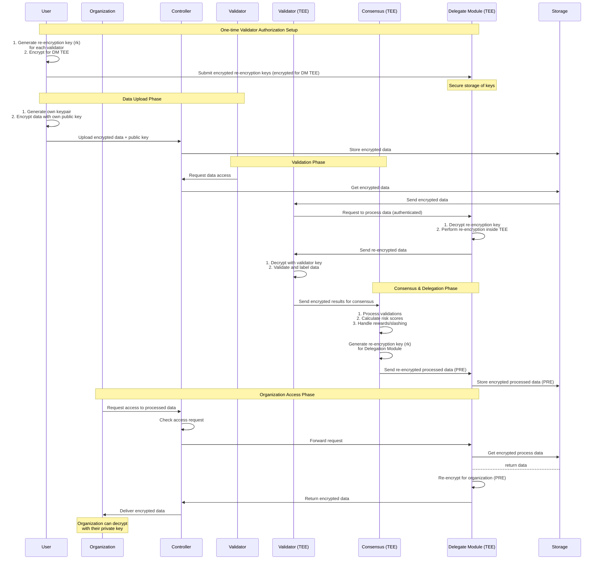

```mermaid
sequenceDiagram
participant U as User
participant O as Organization
participant G as Controller
participant V as Validator
participant VT as Validator (TEE)
participant C as Consensus (TEE)
participant DM as Delegate Module (TEE)
participant S as Storage

    %% One-time Validator Setup
    Note over U,DM: One-time Validator Authorization Setup
    U->>U: 1. Generate re-encryption key (rk)<br/>for each validator <br/> 2. Encrypt for DM TEE
    U->>DM: Submit encrypted re-encryption keys (encrypted for DM TEE)
    Note over DM: Secure storage of keys

    %% Data Upload with PRE
    Note over U,V: Data Upload Phase
    U->>U: 1. Generate own keypair<br/>2. Encrypt data with own public key
    U->>G: Upload encrypted data + public key
    G->>S: Store encrypted data

    %% Validator Processing
    Note over V,C: Validation Phase
    V->>G: Request data access
    G->>S: Get encrypted data
    S->>VT: Send encrypted data

    VT->>DM: Request to process data (authenticated)
    DM->>DM: 1. Decrypt re-encryption key<br/>2. Perform re-encryption inside TEE
    DM->>VT: Send re-encrypted data

    VT->>VT: 1. Decrypt with validator key<br/>2. Validate and label data

    %% Consensus Phase with PRE
    Note over C,DM: Consensus & Delegation Phase
    VT->>C: Send encrypted results for consensus
    C->>C: 1. Process validations<br/>2. Calculate risk scores<br/>3. Handle rewards/slashing
    C->>C: Generate re-encryption key (rk)<br/>for Delegation Module
    C->>DM: Send re-encrypted processed data (PRE)
    DM->>S: Store encrypted processed data (PRE)

    %% Organization Access Phase
    Note over O,DM: Organization Access Phase
    O->>G: Request access to processed data
    G->>G: Check access request
    G->>DM: Forward request
    DM->>S: Get encrypted process data
    S--> DM: return data
    DM->>DM: Re-encrypt for organization (PRE)
    DM->>G: Return encrypted data
    G->>O: Deliver encrypted data

    Note over O: Organization can decrypt<br/>with their private key

```
