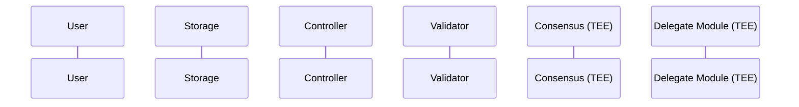

# Secure Genom

## Overview

Secure Genom is a secure genetic data processing system that enables privacy-preserving validation and controlled sharing of genetic data.

## Flow diagram

## Components

### System Architecture Diagram

### Core Components

#### Storage Service

- Encrypted genetic data storage
- Encrypted re-encryption key storage
- Processed results storage
- Data retrieval management

#### Controller

- System metadata management
- Request routing
- Data location tracking
- Access permission verification

#### Validator

- Encrypted data processing
- Genetic data validation
- Result labeling and scoring
- Consensus preparation

#### Consensus Module (TEE)

- Validator result aggregation
- Risk score calculation
- Validator reward management
- Secure data processing

#### Delegate Module (TEE)

- Re-encryption key management
- Proxy re-encryption operations
- Organization access control
- Data sharing management
